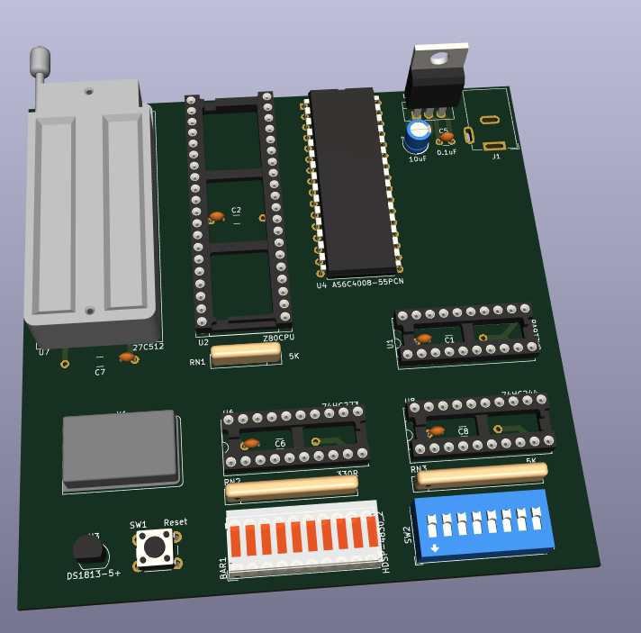
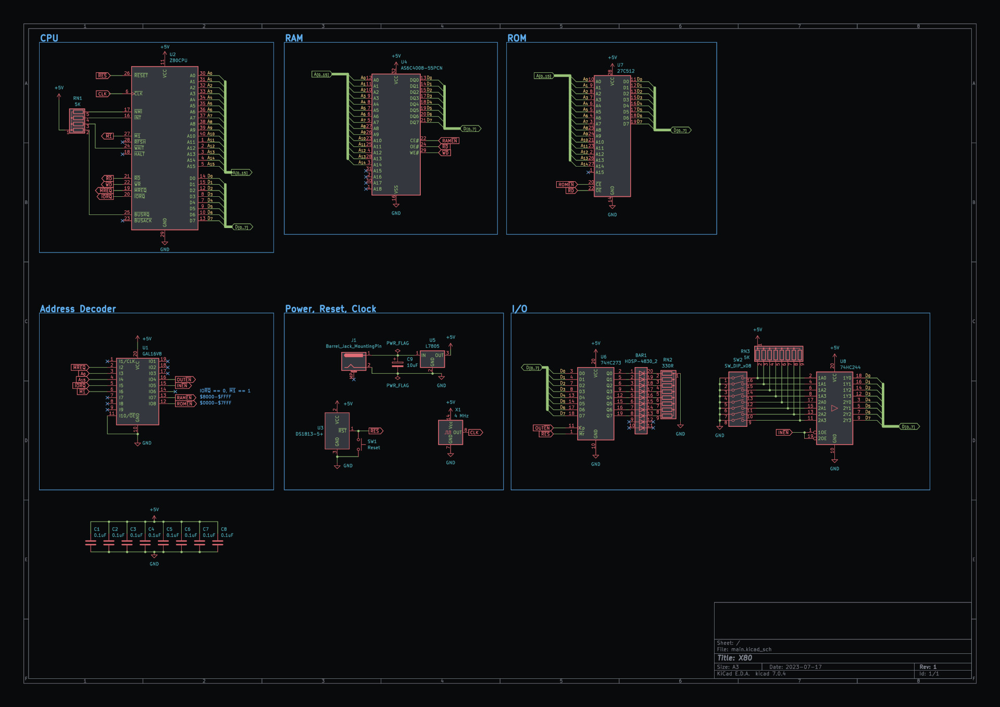

# leo80
Z80-based single-board computer

# Design considerations

- $0000-$7FFF - ROM.
- $8000-$FFFF - RAM.
- Address decoding with ATF16V8.
- Using perfboard for this, so trying to keep it small & simple - will be adding more fancy things later (LCD, UART, etc).
- Simple 8-bit input through '244 tri-state buffer.
- Simple 8-bit output through '273 flip-flop with 8 LEDs for visual output.
- I used AS6C4008 in schematic since it's included in Kicad parts by default. I have various SRAM chips available. Same with W27C512 EPROM.

# Schematic

# PCB

# Resources

- anycpu.org forum [thread](https://anycpu.org/forum/viewtopic.php?f=25&t=1060)
- Original [datasheet](https://www.zilog.com/docs/z80/um0080.pdf) (very slow download), or alternatively - archived versions on [my website](https://dun.ai/files/z80.pdf) and [archive.org](https://archive.org/details/um0080httpswww.zilog.comdocsz80um0080.pdf).

